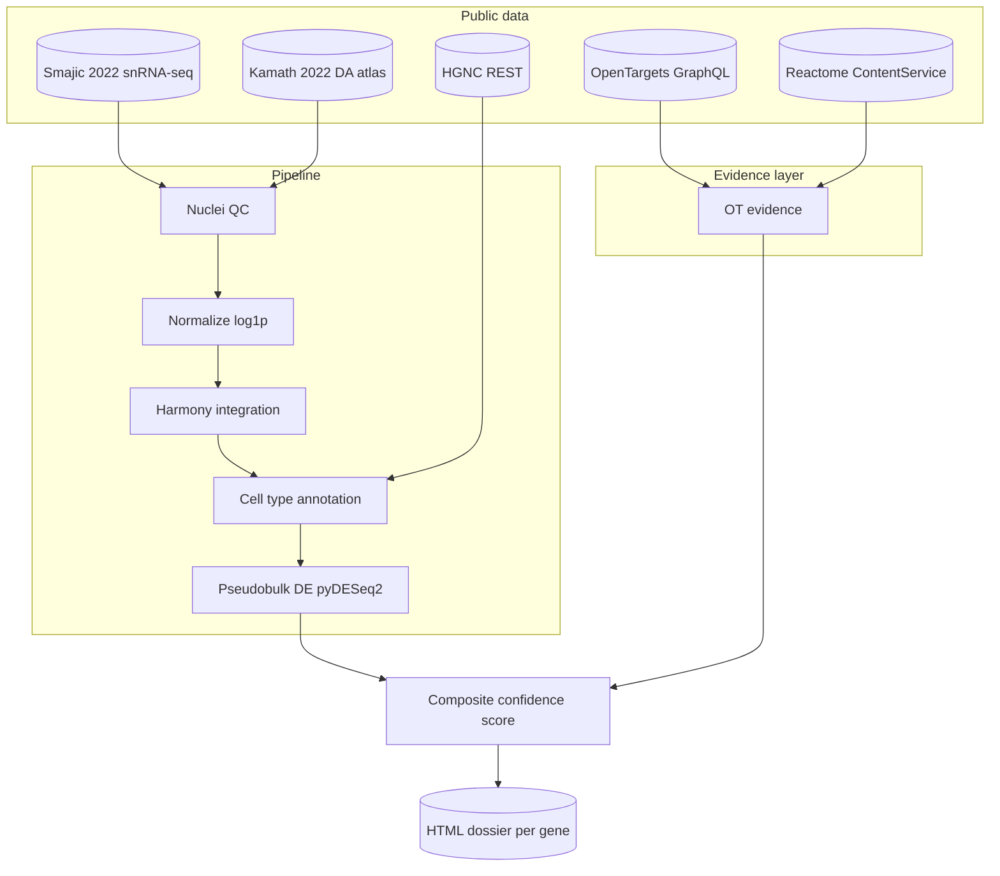

# pd-target-credentialing

*Credentialing Parkinson's disease therapeutic targets by converging single-nucleus expression, human genetics, and tractability evidence — with calibrated confidence and full provenance.*

[](https://github.com/abayatibrain/pd-target-credentialing/actions/workflows/ci.yml)  

## What biological question this answers

Which substantia nigra cell populations are most affected in Parkinson's
disease, and which genes expressed in those populations show converging
evidence — from human genetics, perturbation screens, and disease-associated
cell-state shifts — strong enough to credential them as therapeutic targets?

Read this in plain language: the substantia nigra is the brain region where
Parkinson's begins, and the dopaminergic neurons there die first. Many genes
are *associated* with PD; far fewer have evidence strong enough to justify
a drug program. This pipeline takes a candidate gene, pulls every piece of
public evidence the field has on it, scores how that evidence converges, and
outputs a one-page HTML dossier you could hand a programme lead.

## Architecture



## Quickstart

```bash
git clone https://github.com/abayatibrain/pd-target-credentialing
cd pd-target-credentialing
uv sync
./scripts/download_data.sh
uv run pd-target-credentialing demo
```

## Results

Five worked-example dossiers will land in `results/dossiers/` (SNCA, GBA1,
LRRK2, PRKN, PINK1) before `v1.0.0`. Each dossier contains: a summary card,
expression across nigra cell types, PD-vs-control differential expression,
OpenTargets genetics evidence, tractability bucket, cross-disease context,
and a stacked-bar breakdown of the composite confidence score.

## Method

The pipeline operates in four stages: load, preprocess, analyze, score.

**Load.** Substantia nigra single-nucleus RNA-seq comes from Smajić *et al.*
2022 (*Brain*; doi:10.1093/brain/awab406), with Kamath *et al.* 2022
(*Nat Neurosci*; doi:10.1038/s41593-022-01061-1) as a midbrain-atlas
cross-validation source. The choice between these is defended in ADR-0001.

**Preprocess.** Per-nucleus QC (counts, mito%, Scrublet doublets),
log1p normalization, Harmony integration across donors. The normalization
and integration choices are defended in ADR-0003 and ADR-0004 respectively.

**Analyze.** Cell types are annotated by canonical-marker scoring, with
validation against the Kamath atlas labels. Differential expression uses
pseudobulk + DESeq2 (via `pyDESeq2`); single-cell Wilcoxon is reported as
a secondary check only, because pseudoreplication makes per-cell tests
inappropriate for subject-level claims. See ADR-0006.

**Score.** OpenTargets genetic / literature / animal evidence is combined
with the disease-context DE result and tractability bucket. The composite
formula and its weights are calibrated against known-positive (GBA1, LRRK2)
and known-negative (ACTB) anchor genes — if known positives don't rank
above known negatives by a meaningful margin, the score is a defect, not
a result. See ADR-0009.

## Limitations and honest caveats

- Sample sizes in PD nigra snRNA-seq are small (~6 vs ~5). Tests are
  powered for cell-type DE, not for subject-level inference.
- The dopaminergic neurons we sequence are by definition the ones that
  *did not die*. They are not representative of the cells PD killed.
- "PD association in OpenTargets" is not the same as "causal in PD."
  The score reflects evidence convergence, not mechanism.
- The pipeline does not adjudicate between alpha-synuclein-centric and
  mitochondrial-centric PD models. It reports evidence in both lanes.
- This repo uses only public data. Armin's unpublished mechanism work is
  not in scope here and never will be.

## What's next

- v0.2.0: full OpenTargets integration and the first three example dossiers.
- v0.3.0: calibration check against the anchor-gene set, reported in README.
- v1.0.0: all five example dossiers, demo notebook reproducible in
  ≤15 minutes on a 16 GB MacBook, ≥70% test coverage.

## Citation

See `CITATION.cff` for canonical metadata. BibTeX:

```bibtex
@software{{bayati_pd_target_credentialing_2026,
  author  = {{Bayati, Armin}},
  title   = {{pd-target-credentialing}},
  year    = {{2026}},
  url     = {{https://github.com/abayatibrain/pd-target-credentialing}},
  version = {{0.1.0}}
}}
```

## License

MIT. See `LICENSE`.

---

Built by Armin Bayati ([arminbayati.org](https://arminbayati.org)).
